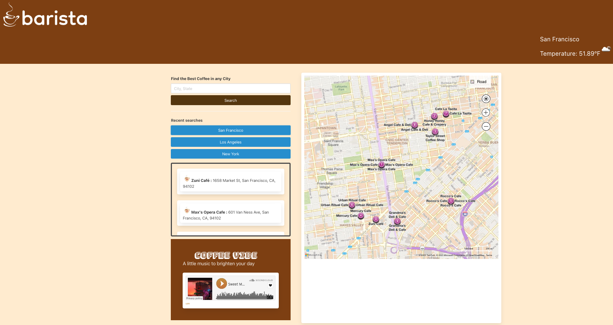
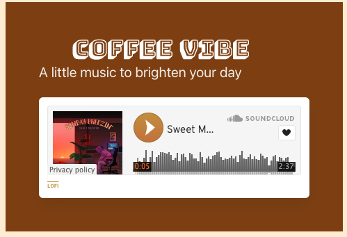
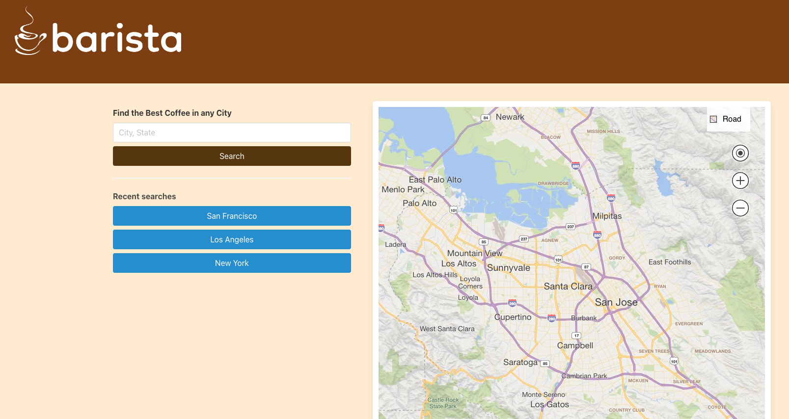

# Barista


## Technology Used 

| Technology Used (API & Framework)         | Resource URL           | 
| ------------- |:-------------:| 
| Microsoft Bing Map API    | [https://learn.microsoft.com/en-us/bingmaps/rest-services/](https://learn.microsoft.com/en-us/bingmaps/rest-services/) | 
| OpenWeather API     | [https://openweathermap.org/current](https://openweathermap.org/current)      |   
| SoundCloud Widget API | [https://developers.soundcloud.com/docs/api/html5-widget](https://developers.soundcloud.com/docs/api/html5-widget)     |
Bulma Framework   | [https://bulma.io/documentation/](https://bulma.io/documentation/)   |
Google Fonts   | [https://fonts.google.com/](https://fonts.google.com/)  |
Font Awesome  | [https://fontawesome.com/docs](https://fontawesome.com/docs)  |

---

## Description 

[Visit the Deployed Site](https://jonnyboy808.github.io/barista/)

The Barista webapp dynamically generates all your cafe searching needs based on user input. On initial page load the user's current city is displayed in the map produced by Bing™. This webapp will display a list of the names and addresss of cafes when a user inputs a city of their choice within the seach box. The user is also greeted by music that auto plays when the page loads and also plays the next song on the playlist to set the mood when searching for their next cafe. Additionally if the user chooses, they may pause and resume the music as they wish. The weather of the inputed searched city is also displayed above the map to make for a better convinence before the user decides to head out to their new chosen cafe.


## Table of Contents

* [Code Example](#code-example)
* [Usage](#usage)
* [Author Info & Credits](#author-info-and-credits)
* [License](#license)


## Code Example


Short example of bulma being implemented 
```html
  <div class="flexbox">
  <div class="container">
    <div class="columns is-two-fifths">
      <div class="column">
        <label class="label">Find the Best Coffee in any City</label>
        <input class="input is-normal" id="searchTbx" type="text" placeholder="City, State">
        <button class="button is-info mt-2 is-fullwidth" id="searchButton">Search</button>
```

Example of javascript code used to fetch coffee shop names and adresses
```JS
var bingApiUrl = "https://dev.virtualearth.net/REST/v1/LocalSearch/?query=cafe&userLocation=" + coordinates[0] + "," + coordinates[1] + ",5000&key=" + bingApiKey;
    fetch(bingApiUrl).then(function (response) {
      if (response.ok) {
      response.json().then(function (bingData) {
        var coffeeShopsEl = document.getElementById("coffeeShops");
          coffeeShopsEl.innerHTML = '';
          var cafeData = bingData.resourceSets[0].resources;
          console.log(cafeData);
          for (var i = 0; i < cafeData.length; i++) {
            var coffeeShop = {
                name: cafeData[i].name,
                coordinate: cafeData[i].point.coordinates,
                address: cafeData[i].Address.formattedAddress
            }
                coffeeShopsData.push(coffeeShop);
                showcoffeeShop(coffeeShop);
                var cityWordArray = cityName.split("%20");
                cityName = cityWordArray.join(" ");
                Search(cityName)
                }
            })
        }}
    );
                                
```

Short example of additional styling that was added after bulma layout
```css
#coffeeShops{
    display:flex;
    flex-direction:column;
    height: 300px;
    box-shadow: 5px;
    border-radius: 5px;
    padding: 20px;
    margin-bottom: 10px;
    -webkit-line-clamp: 2;
    text-overflow: ellipsis;
}
```


## Usage 

Once the deployed site link is opened, the user can start their search for a new cafe using the search box by entering a city of their choosing. The page will dynamically update and display coffee shops of the inputed city, generating the name and adresses in a scroll list. That same search will also produce the current weather conditions of the city located in the top right of the page, which can be seen within the image below.


The webapp also auto plays music when the page is initially loaded and will continue to play following a set library playlist provided by SoundCloud®. The user can also control the music should they wish to pause or continue playing the sound.



On initial page load, the user's current city is automatically displayed in the map, with no need for the user to manually set their city after initial page load.


## Learning Points 


---

## Author Info and Credits

An amazing amout of credit is due to the wonderful team that help bring this webpage to life
Below is each contributors account/s.

```md
- Cassandra: [Github](https://github.com/CTep09)
- Jonathan: [Github](https://github.com/jonnyboy808/)
- Bahareh: [Github](https://github.com/Bhmerir)
- Suchaya: [Github](https://github.com/osuchaya)
```


## License

MIT License

Copyright (c) 2023 jonnyboy808; CTep09; Bhmerir; osuchaya

Permission is hereby granted, free of charge, to any person obtaining a copy
of this software and associated documentation files (the "Software"), to deal
in the Software without restriction, including without limitation the rights
to use, copy, modify, merge, publish, distribute, sublicense, and/or sell
copies of the Software, and to permit persons to whom the Software is
furnished to do so, subject to the following conditions:

The above copyright notice and this permission notice shall be included in all
copies or substantial portions of the Software.

THE SOFTWARE IS PROVIDED "AS IS", WITHOUT WARRANTY OF ANY KIND, EXPRESS OR
IMPLIED, INCLUDING BUT NOT LIMITED TO THE WARRANTIES OF MERCHANTABILITY,
FITNESS FOR A PARTICULAR PURPOSE AND NONINFRINGEMENT. IN NO EVENT SHALL THE
AUTHORS OR COPYRIGHT HOLDERS BE LIABLE FOR ANY CLAIM, DAMAGES OR OTHER
LIABILITY, WHETHER IN AN ACTION OF CONTRACT, TORT OR OTHERWISE, ARISING FROM,
OUT OF OR IN CONNECTION WITH THE SOFTWARE OR THE USE OR OTHER DEALINGS IN THE
SOFTWARE.


---

© 2023 Confidential and Proprietary. All Rights Reserved.
