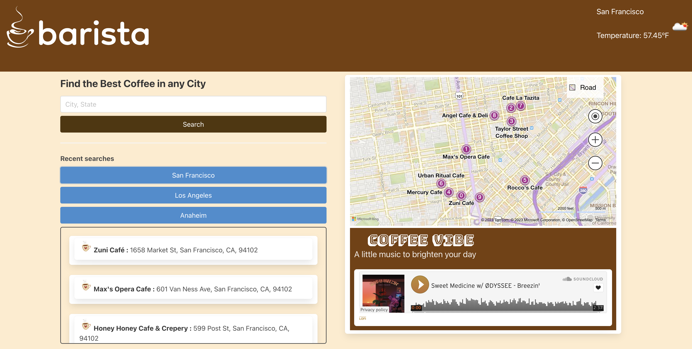

# Barista


## Technology Used 

| Technology Used (API & Framework)         | Resource URL           | 
| ------------- |:-------------:| 
| Microsoft Bing Map API    | [https://learn.microsoft.com/en-us/bingmaps/rest-services/](https://learn.microsoft.com/en-us/bingmaps/rest-services/) | 
| OpenWeather API     | [https://openweathermap.org/current](https://openweathermap.org/current)      |   
| SoundCloud Widget Library | [https://developers.soundcloud.com/docs/api/html5-widget](https://developers.soundcloud.com/docs/api/html5-widget)     |
| Bulma Framework   | [https://bulma.io/documentation/](https://bulma.io/documentation/)   |
| Google Fonts   | [https://fonts.google.com/](https://fonts.google.com/)  |
| Font Awesome  | [https://fontawesome.com/docs](https://fontawesome.com/docs)  |
| Anime.js  | [https://animejs.com/documentation/](https://animejs.com/documentation/) |
| Quotable API | [https://github.com/lukePeavey/quotable](https://github.com/lukePeavey/quotable) |
---

## Description 

[Visit the Deployed Site](https://jonnyboy808.github.io/barista/)

The barista webapp dynamically generates all your cafe searching needs based on user input. On initial page load the user's is greeted by barista's animated logo using the Anime.js library and current city is displayed in the map produced by Bing™. This webapp will display a list of the names and addresses of cafes when a user inputs a city of their choice within the search box. When the user clicks on the search button or previously searched cities, a randomly generated quote of the day will display at the top of the page. The user is also greeted by music that auto plays when the page loads and also auto plays the next song on the playlist to set the mood when searching for their next cafe. Additionally if the user chooses, they may pause and resume the music as they wish. The weather of the inputted searched city is also displayed above the map to make for a better convenience before the user decides to head out to their new chosen cafe.

## User Stories
``` 
1 User
To find new coffee shops when I search for a specific city
So that I could discover new alternatives (Starbucks)
HTML:  Map interface,
Input field for search bar
JS: call bing map API to bring all the nearby coffee shops

2 User
Use the search bar to find a specific city
I find local coffee shops only in that area
HTML: there is a container
JS: add dynamically a list of coffee shops to the existing container

3 User
Previous searches available to me
I can find my searches quickly and easily
HTML: add 3 searched locations
JS: save and retrieve local storage

4 User
To be greeted with coffee shop music
So that I can relax and get into the coffee mood
HTML: soundCloud element to display music
JS: create function to pull a specific genre of music to play

5 User
To show today’s
weather
I can plan my trip to coffee shop
HTML: weather widget to show current weather
JS: create function that pulls current weather conditions to display on HTML
```


## Table of Contents

* [Code Example](#code-example)
* [Usage](#usage)
* [Author Info & Credits](#author-info-and-credits)
* [License](#license)


## Code Example


### Short example of bulma being implemented 
```html
  <div class="flexbox">
  <div class="container">
    <div class="columns is-two-fifths">
      <div class="column">
        <label class="label">Find the Best Coffee in any City</label>
        <input class="input is-normal" id="searchTbx" type="text" placeholder="City, State">
        <button class="button is-info mt-2 is-fullwidth" id="searchButton">Search</button>
```

### Example of javascript code used to fetch coffee shop names and addresses from Bing Map API
```JS
var bingApiUrl = "https://dev.virtualearth.net/REST/v1/LocalSearch/?query=cafe&userLocation=" + coordinates[0] + "," + coordinates[1] + ",5000&key=" + bingApiKey;
    fetch(bingApiUrl).then(function (response) {
      if (response.ok) {
      response.json().then(function (bingData) {
        var coffeeShopsEl = document.getElementById("coffeeShops");
          coffeeShopsEl.innerHTML = '';
          var cafeData = bingData.resourceSets[0].resources;
          console.log(cafeData);
          for (var i = 0; i < cafeData.length; i++) {
            var coffeeShop = {
                name: cafeData[i].name,
                coordinate: cafeData[i].point.coordinates,
                address: cafeData[i].Address.formattedAddress
            }
                coffeeShopsData.push(coffeeShop);
                showcoffeeShop(coffeeShop);
                var cityWordArray = cityName.split("%20");
                cityName = cityWordArray.join(" ");
                Search(cityName)
                }
            })
        }}
    );
                                
```
#### Bing Map API call in action


### Calling Open Weather Map API 
``` js
function handleCallingApis(cityName) {
    var coordinates = [];
    var GeoApiUrl = "https://api.openweathermap.org/geo/1.0/direct?q=" + cityName + "&appid=" + weatherApiKey;
    //This fetch brings the response about Geographical coordinates
    fetch(GeoApiUrl).then(function (response) {
        if (response.ok) {
            response.json().then(function (geoData) {
                //If the city is not found, the length of data list will be empty
                if (geoData.length === 0) {
                    // alert("The searched city is not found!");
                    citySearch.value = "";
                    var searchedCityModal = document.getElementById('searchedCityModal');
                    searchedCityModal.classList.add('is-active');
                    searchedCityModal.querySelector('.modal-close').addEventListener('click', function () {
                        searchedCityModal.classList.remove('is-active');
                    })

                }
                else {
                    //If city is found, its longitude and lattitude will be retrieved and sent to the weather API
                    coordinates.push(geoData[0].lat);
                    coordinates.push(geoData[0].lon);
                    // Call saveSearch function here
                    saveSearch(cityName);
                    //call the map api to show the curent city
                    var weatherApiUrl = "https://api.openweathermap.org/data/2.5/weather?lat=" + coordinates[0] + "&lon=" + coordinates[1] + "&appid=" + weatherApiKey;
                    //This fetch brings the response about today's weather
                    fetch(weatherApiUrl).then(function (response) {
                        if (response.ok) {
                            response.json().then(function (todayData) {
                                var tempFarenheit = parseFloat(((todayData.main.temp - 273) * 1.8) + 32).toFixed(2);
                                var cityWordArray = cityName.split("%20");
                                var searchedCityValue = cityWordArray.join(" ");
                                var weatherCondition = {
                                    city: searchedCityValue,
                                    temp: tempFarenheit + " ºF",
                                    icon: todayData.weather[0].icon
                                }
                                showWeatherSituation(weatherCondition)

```

#### Open Weather Map API call in action


### Quotable API Call
``` js
  var quoteEl = document.getElementById("quote");
  quoteEl.textContent = "";
  var quoteTitleEl = document.getElementById("quote-title");
  quoteTitleEl.textContent = "";
  //This fetch brings a random quote
  var quoteApiUrl = "https://api.quotable.io/random?maxLength=120";
  fetch(quoteApiUrl).then(function (response) {
    if (response.ok) {
      response.json().then(function (quoteData) {
        var quote = quoteData.content;
        quoteEl.textContent = quote;
        quoteTitleEl.textContent = "Quote of the day :";
      });
    }
      else {
        // alert("There is a connection error!")
        var connectionError = document.getElementById('connectionError');
        connectionError.classList.add('is-active');
        connectionError.querySelector('modal-close').addEventListener('click', function () {
        connectionError.classList.remove('is-active');
      })
    }
    });
  });
```

#### Quotable API call in action


## Libraries Used
### Soundcloud Library 
``` html
<div class="box" id="soundCloud">
  <iframe width="100%" height="100" scrolling="no" frameborder="no" allow="autoplay"
       src="https://w.soundcloud.com/player/?url=https%3A//api.soundcloud.com/playlists/483718232&color=%23be8d34&auto_play=true&sharing=false&hide_related=true&show_user=false&show_reposts=false&buying=false">
   </iframe>
   <div style="font-size: 8px; color: #cccccc;line-break: anywhere;word-break: normal;overflow: hidden;white-space: nowrap;text-overflow: ellipsis; font-family: Interstate,Lucida Grande,Lucida Sans Unicode,Lucida Sans,Garuda,Verdana,Tahoma,sans-serif;font-weight: 100;">
        <a href="https://soundcloud.com/lofi-hip-hop-music/sets/lofi-hip-hop-beats" title="𝗟𝗢𝗙𝗜" target="_blank" style="color: #be8d34; text-decoration: overline;">𝗟𝗢𝗙𝗜</a>
    </div>
</div>
```

####  SoundCloud in action


### Anime.js
``` js
const barista = document.querySelector('.barista');
anime({
  targets: barista,
  keyframes: [
    {translateY: -20},
    {translateX: 75},
    {translateY: 40},
    {translateX: 0},
    {translateY: 0}
  ],
  duration: 4000,
  easing: 'easeOutElastic(1, .8)',
});
```

#### Anime.js in action


Short example of additional styling that was added after Bulma layout
```css
#coffeeShops{
    display:flex;
    flex-direction:column;
    height: 300px;
    box-shadow: 5px;
    border-radius: 5px;
    padding: 20px;
    margin-bottom: 10px;
    -webkit-line-clamp: 2;
    text-overflow: ellipsis;
}
```

## Usage 

Once the deployed site link is opened, the user can start their search for a new cafe using the search box by entering a city of their choosing. The page will dynamically update and display coffee shops of the inputed city, generating the name and adresses in a scroll list. That same search will also produce a randomly generated quote of the day and the current weather conditions of the city searched will be displayed in the top right of the page, which can be seen within the image below.


The webapp also auto plays music when the page is initially loaded and will continue to play following a set library playlist provided by SoundCloud®. The user can also control the music should they wish to pause or continue playing the sound.


On initial page load, the user's current city is automatically displayed in the map, with no need for the user to manually set their city after initial page load.


## Learning Points 


---

## Author Info and Credits

An amazing amout of credit is due to the wonderful team that help bring this webpage to life
Below is each contributors account/s.

```md
- Cassandra: [Github](https://github.com/CTep09)
- Jonathan: [Github](https://github.com/jonnyboy808/)
- Bahareh: [Github](https://github.com/Bhmerir)
- Suchaya: [Github](https://github.com/osuchaya)
```


## License

MIT License

Copyright (c) 2023 jonnyboy808; CTep09; Bhmerir; osuchaya

Permission is hereby granted, free of charge, to any person obtaining a copy
of this software and associated documentation files (the "Software"), to deal
in the Software without restriction, including without limitation the rights
to use, copy, modify, merge, publish, distribute, sublicense, and/or sell
copies of the Software, and to permit persons to whom the Software is
furnished to do so, subject to the following conditions:

The above copyright notice and this permission notice shall be included in all
copies or substantial portions of the Software.

THE SOFTWARE IS PROVIDED "AS IS", WITHOUT WARRANTY OF ANY KIND, EXPRESS OR
IMPLIED, INCLUDING BUT NOT LIMITED TO THE WARRANTIES OF MERCHANTABILITY,
FITNESS FOR A PARTICULAR PURPOSE AND NONINFRINGEMENT. IN NO EVENT SHALL THE
AUTHORS OR COPYRIGHT HOLDERS BE LIABLE FOR ANY CLAIM, DAMAGES OR OTHER
LIABILITY, WHETHER IN AN ACTION OF CONTRACT, TORT OR OTHERWISE, ARISING FROM,
OUT OF OR IN CONNECTION WITH THE SOFTWARE OR THE USE OR OTHER DEALINGS IN THE
SOFTWARE.


---

© 2023 Confidential and Proprietary. All Rights Reserved.
